# The Dormitory Web Application with Laravel Jetstream Inertia

This is a Laravel 8 project that allows dormitory management and students to easily perform their transactions about the dormitory. This app will act as a platform between students and the dormitory management.

## What can be done with this project?

Dormitory Managers can

- share announcements, news
- share and edit rooms 
- place students in suitable rooms 
- charge dormitory fees from students 
- send messages 

Students can

- see all announcements
- see available rooms 
- apply for an available room 
- send change request for their current room 
- pay dorm fee 
- send messages


## Notes
- To use Vue.js, make sure that you install Vue.js via npm.
To install, run the command below in the project terminal.
```bash
npm install vue
```
- Make sure that all servers is running in XAMPP.

- Run the commands below in the terminal that project locates.

```bash
php artisan serve
```

The project can now be accessed at

```bash
http://localhost:8000
```

## Gallery

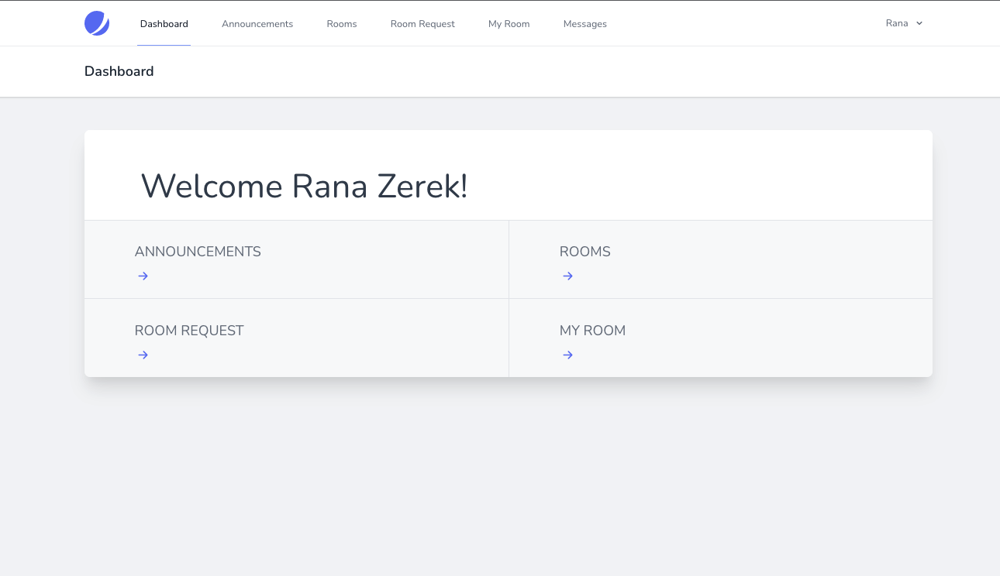

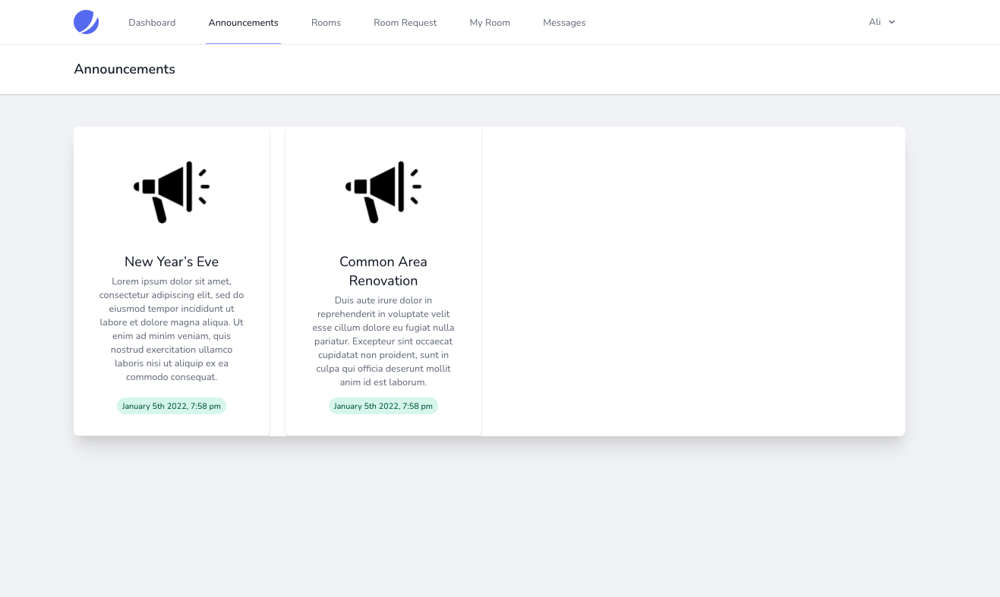

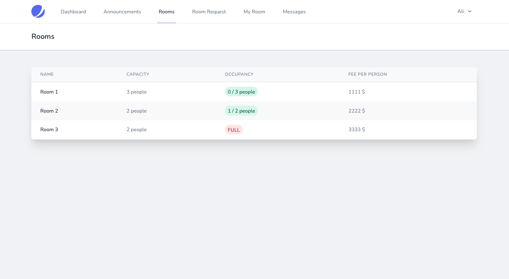

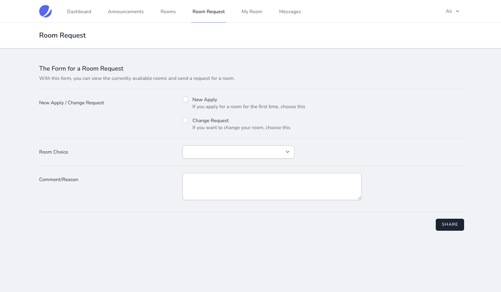

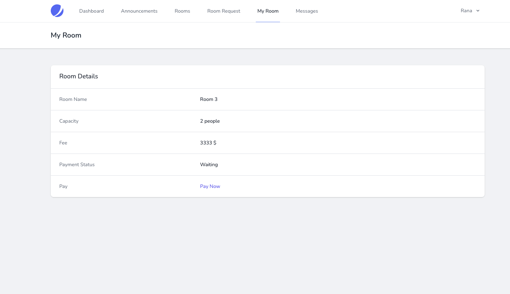

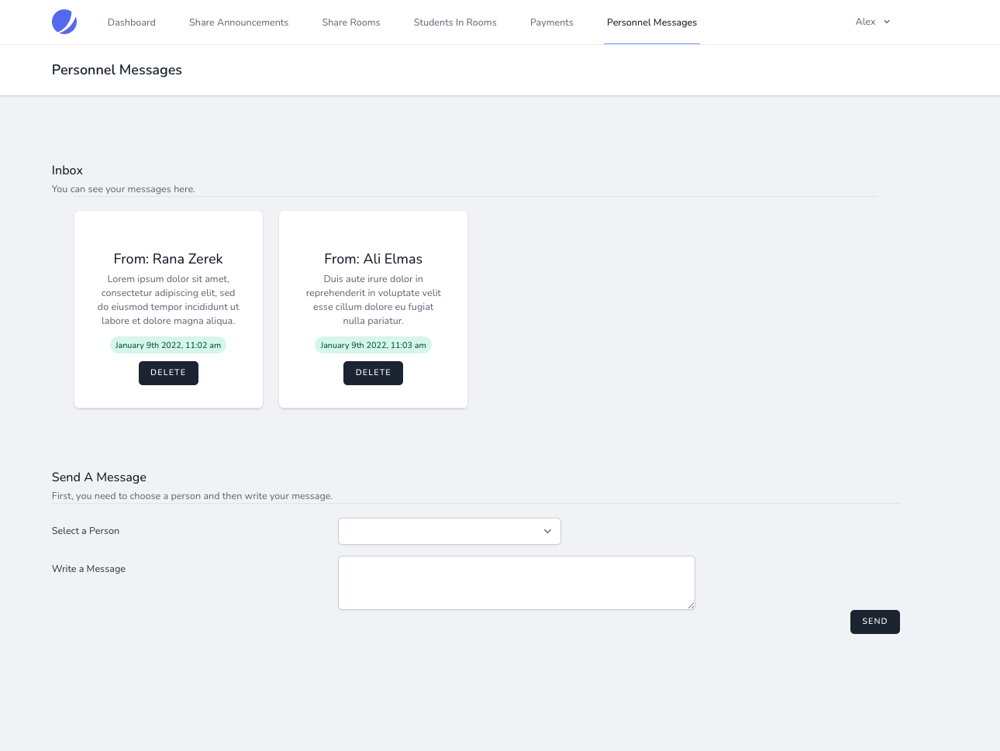

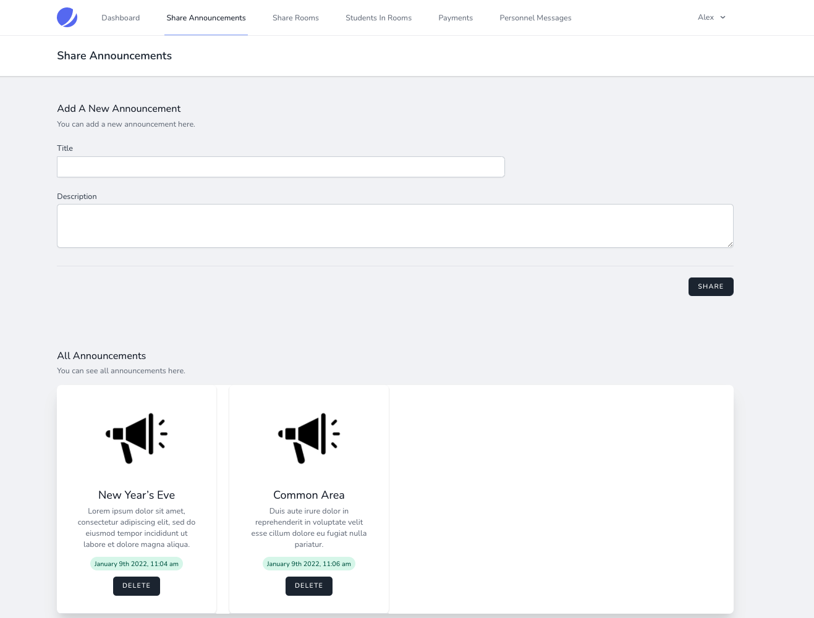


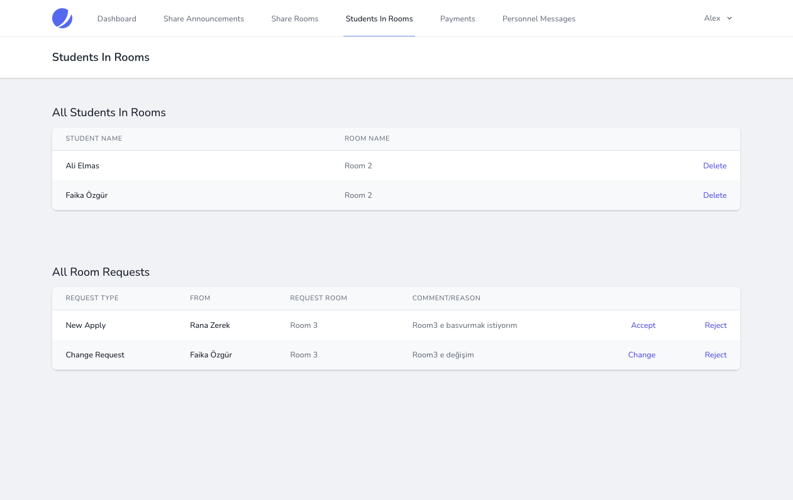

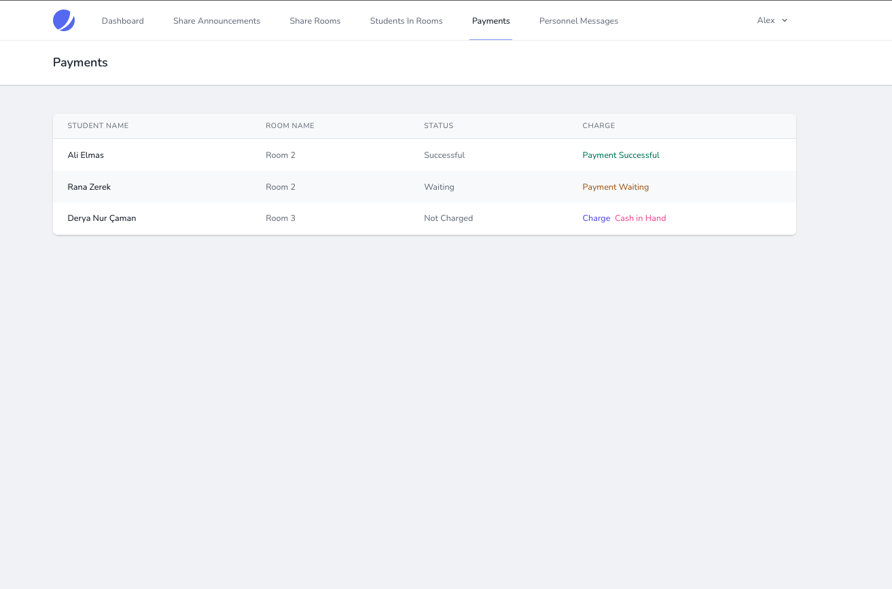

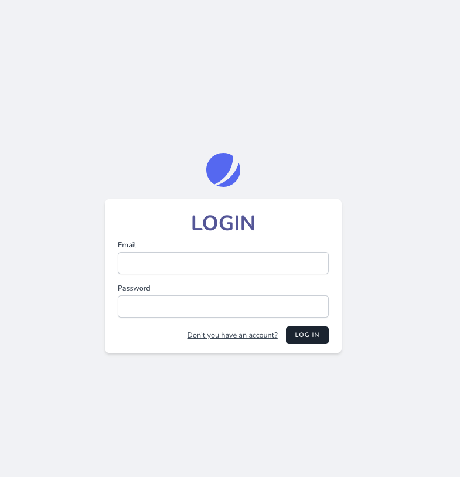

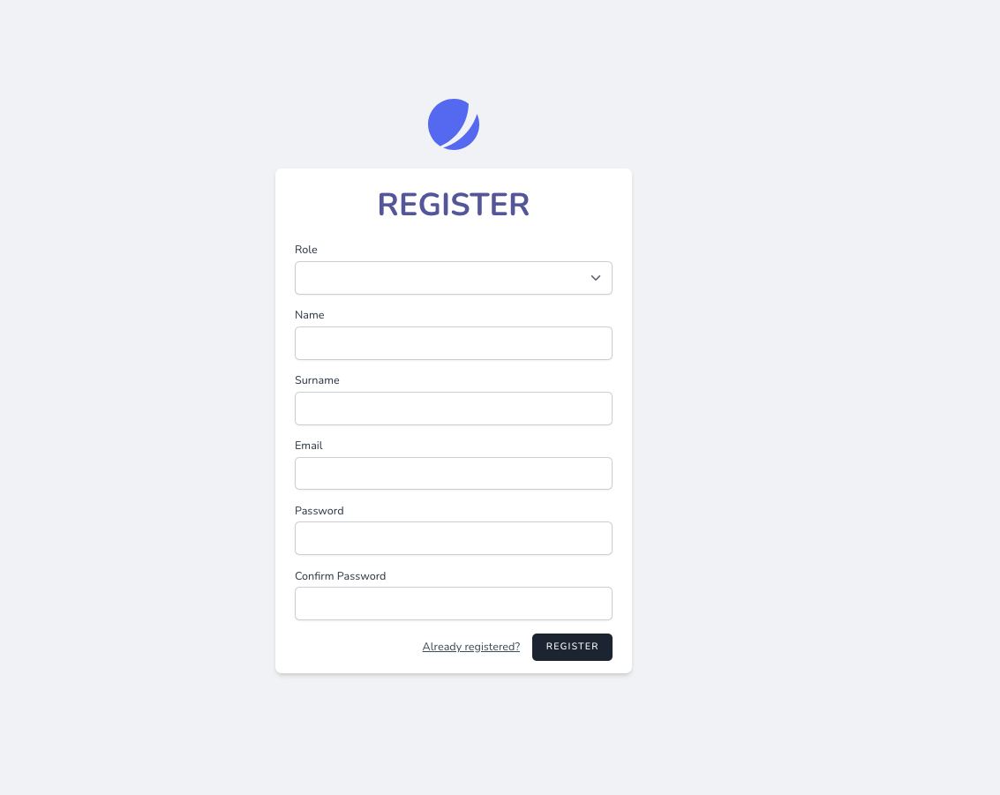


